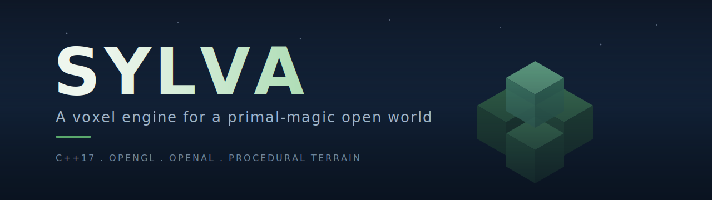

<div align="center">



<br/>

[](https://en.cppreference.com/w/cpp/17)
[](https://cmake.org/)
[](https://www.opengl.org/)
[](https://openal-soft.org/)
[](https://vcpkg.io/)
[](#)
[](.github/workflows/lint.yml)
[](#status)
[](#license)

</div>

---

Sylva is a voxel game engine written in C++17 on top of OpenGL and OpenAL. It renders a chunked micro-voxel world that the player explores in third person. Terrain is generated procedurally from layered noise, meshed per chunk with culled faces and per-vertex ambient occlusion (with correct diagonal-neighbor sampling), and lit with a single directional source plus per-biome color variation. The engine is small, dependency-light, and built to grow into a full survival and exploration game.

## Highlights

- **Chunked voxel world.** 32 cubed chunks, view-distance streaming, neighbor-aware meshing.
- **Procedural terrain.** Biome and feature generators layered on top of multi-octave noise, with plateau quantization tuned for walkable terraced terrain.
- **Async chunk pipeline.** Background chunk generation and meshing, frustum culling, distance fog. Packed chunk vertices (12 bytes each).
- **Voxel character.** Animated grid-built character with walk and idle cycles, hair, face, and clothing.
- **Spatial audio.** PCM WAV loader, OpenAL listener tracking the camera, per-type volumes and mute, thread-safe under concurrent playback.
- **Third-person orbit camera.** Configurable distance, height, sensitivity, with world-collision raycast so the view never clips into terrain.
- **Service-locator architecture.** `Logger` and `Config` are real swappable instances behind a static facade. `IAudioSystem` is an interface with an `OpenALAudioSystem` implementation. Tests can substitute fakes without touching call sites.
- **Config-driven.** `default_config.ini` plus a local `user_config.ini` override cover window, audio, camera, player, world generation, and debug toggles.
- **RAII everywhere.** Every GL and AL handle (shaders, buffers, sources, the audio context itself) lives in a class whose destructor releases it.

## Tech stack

| Layer        | Library                                                          |
| ------------ | ---------------------------------------------------------------- |
| Windowing    | [GLFW3](https://www.glfw.org/)                                   |
| GL loader    | [GLAD](https://glad.dav1d.de/)                                   |
| Math         | [GLM](https://github.com/g-truc/glm)                             |
| Model import | [tinyobjloader](https://github.com/tinyobjloader/tinyobjloader)  |
| Audio        | [OpenAL Soft](https://openal-soft.org/) plus a hand-rolled PCM WAV parser |
| Build        | CMake 3.15+ and [vcpkg](https://vcpkg.io/) manifest mode         |

## Build

**Prerequisites:** Visual Studio 2019 or newer (or any C++17 compiler), CMake 3.15+, `vcpkg` cloned and bootstrapped, and the `VCPKG_ROOT` environment variable set.

```powershell
git clone https://github.com/Nathandona/Sylva.git
cd Sylva

cmake -S . -B build -DCMAKE_TOOLCHAIN_FILE="$env:VCPKG_ROOT\scripts\buildsystems\vcpkg.cmake"
cmake --build build --config Debug

.\build\Debug\Sylva.exe
```

vcpkg pulls every dependency listed in [`vcpkg.json`](vcpkg.json) on first configure. Assets and config files are copied next to the binary automatically, so the built executable runs standalone.

## Configuration

Two layered INI files:

| File                                                     | Purpose                              |
| -------------------------------------------------------- | ------------------------------------ |
| [`config/default_config.ini`](config/default_config.ini) | Engine defaults, version-controlled. |
| `config/user_config.ini`                                 | Local overrides, not committed.      |

Common knobs: `Window.*`, `Audio.*`, `AudioAssets.*` (sound file paths), `Camera.*`, `Player.*`, `World.cell_size`, `World.view_distance`, `World.plateau_width_voxels`, `World.chunk_y_min` / `chunk_y_max`, `Debug.collision_visualization`, `Debug.max_frames`.

## Architecture

```
main()
  +- Engine
       +- owns Window (GLFW)
       +- owns Camera, Player, VoxelWorld
       +- owns std::unique_ptr<IAudioSystem>  (concrete: OpenALAudioSystem)
       +- owns std::unique_ptr<UISystem>
       +- owns player Shader

Logger / Config       service locator plus static facade, reachable anywhere
                       via Logger::logInfo / Config::getInt; tests swap with
                       setCurrent(&fake).

Input                 free functions (GLFW callbacks need C-linkage).

VoxelWorld            owns a TerrainGenerator and the chunk map. getHeightAt
                       is O(1): it samples the generator noise directly instead
                       of scanning blocks.

Chunk meshing         driven by a BlockSampler callback that resolves any
                       chunk-local offset, including diagonals, via the world,
                       so ambient occlusion is correct at chunk corners.
```

## Project layout

```
src/
  main.cpp                application entry, top-level try/catch
  engine.{h,cpp}          init, tick / renderFrame / debug toggles / FPS log
  audio/                  IAudioSystem interface, OpenALAudioSystem impl, WAV loader
  core/                   Config and Logger (service locator), shared types
  platform/               window (GLFW), input (free functions)
  renderer/               camera, shader (RAII plus uniform cache), UISystem
  world/
    voxel_world.{h,cpp}   chunk store, render, collision, fast getHeightAt
    player.{h,cpp}        movement and physics (no Camera dependency)
    block.{h,cpp}         block types and palette
    chunk/                storage, culled-face meshing, per-vertex AO
    generation/           terrain (noise composition), biome, feature gen

config/                   INI configs (defaults committed)
assets/                   shaders, audio (WAV preferred), textures, models
```

## Controls

| Input            | Action                        |
| ---------------- | ----------------------------- |
| `W` `A` `S` `D`  | Move (camera-relative)        |
| Mouse            | Orbit camera                  |
| Scroll wheel     | Zoom                          |
| `Space`          | Jump                          |
| `F1`             | Toggle collision debug points |
| `Esc`            | Quit                          |

## Status

Pre-alpha. Runnable, hackable, not yet playable.

**Done**

- Async chunk streaming, meshing, culled-face rendering, frustum culling, distance fog
- Per-vertex ambient occlusion with correct chunk-corner sampling
- Packed 12-byte chunk vertices
- Orbit camera, player controller, voxel collision, auto-step
- Animated voxel character (walk and idle)
- Config and Logger as swappable services, AudioSystem behind a DI interface
- Real PCM WAV playback, thread-safe audio
- O(1) terrain height query for ground snapping

**In progress**

- Asset and shader managers (currently the engine owns one player shader)
- OGG / Vorbis decoder for music (only WAV is supported today)

**Planned**

- Greedy meshing and level-of-detail
- Block break and place, with `getHeightAt` aware of player edits
- Gameplay: combat, crafting, magic, expanded biomes

See [`CLAUDE.md`](CLAUDE.md) for the architecture and conventions cheat-sheet, and [`AUDIT.md`](AUDIT.md) for the original code-quality review.

## License

Not yet chosen. All rights reserved until a `LICENSE` file lands.
